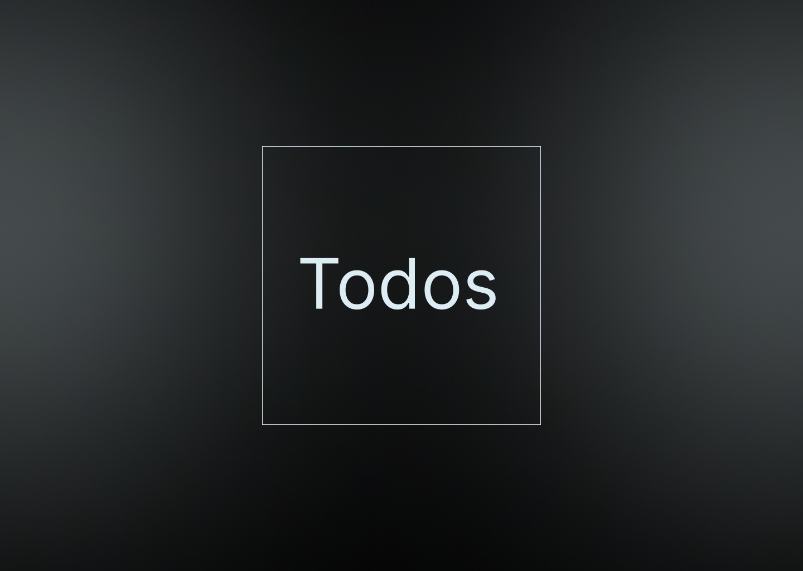

<div style="display: flex; justify-content: center;"></div>

## 🧰 `Технологии`

[](https://www.typescriptlang.org/)
[](https://vitejs.dev/)
[](https://react.dev/)
[](https://tailwindcss.com/)
[](https://html.spec.whatwg.org/multipage/)
[](https://redux.js.org/)
[](https://eslint.org/)
[](https://prettier.io/)
[](https://jestjs.io/)
[](https://testing-library.com/docs/react-testing-library/intro/)

## 📢 `Основные команды`

```js
🚀 npm run dev
🚀 npm run build
🚀 npm run preview
```

Если возникли проблемы с запуском приложения [telegram](https://t.me/maslinok)
